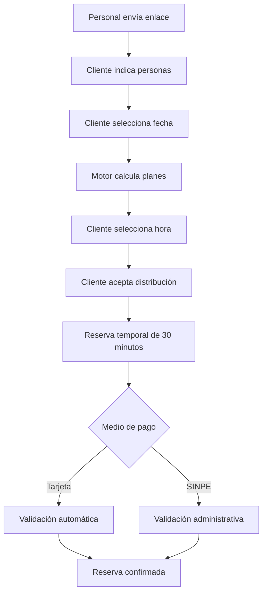
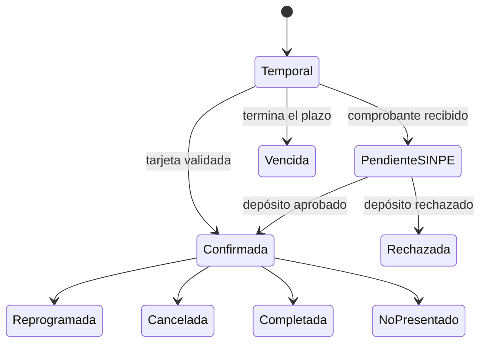
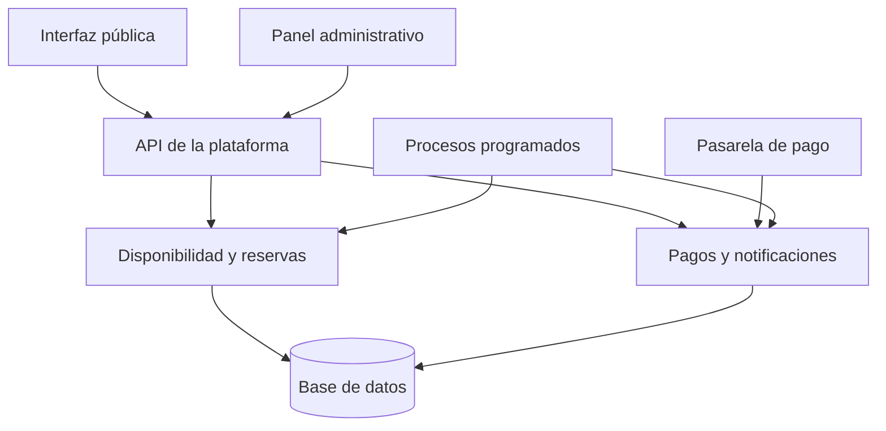

# Propuesta de plataforma de reservas para Sarapiquí Race Park

## Especificación funcional y técnica base para el proyecto

**Versión:** 1.2  
**Fecha:** 12 de septiembre de 2026  
**Estado:** Propuesta para definición y validación del proyecto  
**Alcance inicial:** Reservas de karts  

---

## 1. Propósito del documento

Este documento define la propuesta funcional y técnica de una plataforma de reservas para Sarapiquí Race Park. Su finalidad es servir como base común para diseñar el producto, estimar el esfuerzo de desarrollo, seleccionar la tecnología, preparar las pruebas y validar el comportamiento esperado antes de iniciar la implementación.

La plataforma permitirá que una persona consulte la disponibilidad real, seleccione una fecha y una hora, reserve espacios para una cantidad determinada de participantes y pague un depósito equivalente al 50 % del monto total. La reserva quedará confirmada automáticamente cuando el depósito se pague mediante una pasarela de tarjeta que permita verificar la transacción. Cuando el pago se realice por SINPE, una persona autorizada de Sarapiquí Race Park deberá validar el depósito.

El producto mínimo viable, denominado en este documento **MVP**, se concentrará en las reservas de karts. El agente conversacional con inteligencia artificial y el alquiler de vehículos de radiocontrol se incorporarán posteriormente sobre los mismos servicios de disponibilidad, reservación y pago.

La decisión técnica central es modelar la operación mediante bloques de 15 minutos y lotes operativos. Cada heat ocupa un bloque y admite hasta cinco personas. Un lote contiene uno o más heats consecutivos y termina con un bloque interno de 15 minutos para limpiar y preparar los karts. Diferentes reservas pueden compartir un heat siempre que la suma de participantes no supere cinco. Las personas de una misma reserva se distribuirán de la forma más equilibrada posible entre sus heats: la diferencia entre el heat con más participantes y el heat con menos participantes no podrá superar una persona. Las reservas de hasta 15 personas deben completarse en un solo lote, sin pausas entre sus heats. Las reservas de más de 15 personas también se intentarán programar como un único lote; si la disponibilidad no lo permite, podrán dividirse en varios lotes separados por el almuerzo, otras reservas o cualquier indisponibilidad.

---

## 2. Objetivos del proyecto

### 2.1 Objetivo general

Implementar una plataforma confiable y fácil de usar para administrar la disponibilidad, las reservas temporales, los depósitos y las confirmaciones de las actividades de Sarapiquí Race Park.

### 2.2 Objetivos específicos

1. Mostrar al cliente únicamente fechas y horas que permitan completar su grupo según la capacidad real del parque.
2. Dividir automáticamente cada grupo en uno o más heats de hasta cinco personas y repartirlo equitativamente.
3. Permitir que varios clientes compartan un heat hasta completar sus cinco espacios.
4. Agrupar heats consecutivos en un lote operativo.
5. Bloquear 15 minutos para limpieza y preparación después del último heat de cada lote.
6. Mantener consecutivos los heats de reservas de hasta 15 personas.
7. Permitir que las reservas superiores a 15 personas se dividan en varios lotes cuando sea necesario.
8. Evitar que un lote o su bloque de limpieza se cruce con el almuerzo, un cierre, un bloqueo administrativo o una operación incompatible.
9. Retener temporalmente la capacidad durante 30 minutos mientras el cliente paga el depósito.
10. Confirmar automáticamente los pagos con tarjeta cuando la pasarela comunique y permita verificar el resultado.
11. Permitir la verificación manual de depósitos realizados mediante SINPE.
12. Brindar al personal un panel para gestionar horarios, excepciones, bloqueos, pagos y reservas.
13. Preparar una interfaz de integración para que un agente de IA pueda consultar información y enviar al cliente un enlace de reserva en una fase posterior.
14. Diseñar el núcleo de la plataforma para incorporar posteriormente crawlers, excavadoras, vagonetas y otros vehículos RC.

---

## 3. Alcance

### 3.1 Alcance del MVP

El MVP incluirá:

- Página pública de reservas adaptable a teléfonos, tabletas y computadoras.
- Campo para indicar la cantidad de personas.
- Selector gráfico de fecha.
- Lista desplegable que muestre únicamente horas viables.
- Cálculo automático de la cantidad de heats.
- Distribución equitativa de participantes entre los heats de una misma reserva.
- Asignación de participantes en heats existentes con capacidad disponible o en nuevos heats.
- Lotes de heats consecutivos.
- División en varios lotes únicamente para grupos superiores a 15 personas.
- Bloqueo obligatorio de limpieza después de cada lote.
- Horario semanal habitual.
- Horario de almuerzo.
- Aperturas extraordinarias, como feriados específicos.
- Cierres completos por fecha.
- Bloqueos parciales por eventos privados, mantenimiento u otras razones.
- Reserva temporal durante 30 minutos.
- Depósito del 50 %.
- Pago mediante SINPE con validación manual.
- Integración con una pasarela de pago con tarjeta, una vez seleccionado el proveedor.
- Confirmación automática del pago con tarjeta mediante notificación verificable de la pasarela.
- Panel administrativo.
- Creación, consulta, confirmación, rechazo, reprogramación y cancelación de reservas.
- Historial de cambios y auditoría básica.
- Protección contra reservas duplicadas y sobreventa de capacidad.
- Preparación de servicios internos para futuras integraciones.

### 3.2 Elementos fuera del MVP

Los siguientes componentes no forman parte del MVP inicial:

- Agente conversacional con IA.
- Atención automatizada por WhatsApp, Instagram o Facebook Messenger.
- Confirmación automática de transferencias SINPE.
- Aplicación móvil nativa.
- Programa de fidelización.
- Cupones o promociones complejas.
- CRM avanzado.
- Pronóstico de demanda.
- Contabilidad completa.
- Alquiler de crawlers, excavadoras, vagonetas u otros vehículos RC.

### 3.3 Evolución prevista

La arquitectura deberá admitir tres etapas:

1. **MVP de karts:** calendario, disponibilidad, reservas, pagos y administración.
2. **Atención con IA:** agente que responda preguntas, consulte reglas y entregue enlaces de reserva personalizados.
3. **Catálogo ampliado:** recursos RC con capacidad, duración, preparación, precio y calendario propios.

---

## 4. Actores del sistema

| Actor | Responsabilidad principal |
|---|---|
| Cliente | Consultar disponibilidad, seleccionar heats, proporcionar datos, pagar el depósito y recibir confirmación. |
| Personal de atención | Brindar información, enviar el enlace de reservas y apoyar al cliente cuando sea necesario. |
| Operador del parque | Consultar el calendario operativo, participantes y distribución de heats. |
| Administrador | Configurar horarios, bloqueos, precios y usuarios; gestionar reservas y validar SINPE. |
| Pasarela de pago | Generar el enlace de pago, procesar la tarjeta y notificar el resultado. |
| Agente de IA futuro | Responder preguntas y dirigir al cliente al proceso de reservación sin modificar directamente las reglas del calendario. |

---

## 5. Glosario operativo

| Término | Definición |
|---|---|
| Bloque | Unidad mínima de tiempo del sistema, con una duración de 15 minutos. |
| Heat | Periodo de 15 minutos en el que participan hasta cinco personas. |
| Capacidad del heat | Cinco personas en total, aunque pertenezcan a diferentes reservas. |
| Lote operativo | Secuencia de uno o más heats consecutivos seguida por un bloque de limpieza. |
| Limpieza | Bloque de 15 minutos inmediatamente posterior al último heat de un lote operativo. |
| Asignación | Cantidad de personas de una reserva colocadas en un heat determinado. |
| Plan de reserva | Conjunto ordenado de lotes y heats asignados a una reserva. |
| Hora de inicio | Hora del primer heat asignado a la reserva. |
| Fin de actividad del cliente | Fin del último heat asignado al grupo; no incluye limpieza. |
| Liberación operativa | Fin de la limpieza del último lote asignado; se utiliza internamente para calcular disponibilidad. |
| Reserva temporal | Retención de capacidad durante 30 minutos mientras se gestiona el depósito. |
| Reserva confirmada | Reserva cuyo depósito fue validado. |
| Excepción de calendario | Regla aplicable a una fecha concreta que abre, cierra o modifica el horario habitual. |
| Bloqueo administrativo | Periodo no reservable creado por una persona autorizada. |

---

## 6. Reglas de negocio definitivas

### 6.1 Duración y capacidad

1. La unidad mínima de programación será de 15 minutos.
2. Cada heat durará 15 minutos.
3. Cada heat tendrá una capacidad máxima de cinco personas.
4. El sistema permitirá varias reservas dentro del mismo heat si la suma de participantes no supera cinco.
5. Un lote operativo podrá contener uno o más heats consecutivos.
6. Después del último heat de cada lote se bloquearán 15 minutos para limpieza y preparación.
7. El bloque de limpieza será global. Durante ese periodo no podrá realizarse ningún heat.
8. Una reserva de hasta 15 personas deberá completarse en un solo lote. Sus heats no podrán separarse.
9. Una reserva de más de 15 personas se intentará programar primero como un solo lote con todos sus heats consecutivos y una sola limpieza.
10. Si ese lote continuo no cabe, la reserva podrá dividirse en dos o más lotes. Cada lote tendrá una limpieza propia.
11. Los lotes de una reserva superior a 15 personas podrán separarse por otros lotes, limpiezas, el almuerzo, eventos privados u otros periodos no disponibles.
12. Dentro de cada lote, los heats siempre serán consecutivos.
13. El motor minimizará la cantidad de lotes y, por tanto, la cantidad de limpiezas.
14. Todos los lotes de una reserva deberán asignarse dentro de la misma fecha en el MVP.
15. No se establece un máximo comercial de personas por reserva. El límite efectivo dependerá de la capacidad restante del día.
16. La distribución de una reserva entre sus heats deberá ser equitativa: la diferencia entre la mayor y la menor asignación será como máximo de una persona.
17. El bloque de limpieza se utilizará para validar disponibilidad, pero no se mostrará como parte de la duración de la actividad del cliente.

### 6.2 Horario habitual

La configuración inicial será:

| Día | Horario |
|---|---|
| Sábado | 9:00 a. m. a 4:00 p. m. |
| Domingo | 9:00 a. m. a 4:00 p. m. |
| Feriado habilitado | 9:00 a. m. a 4:00 p. m. |
| Almuerzo | 12:00 m. a 12:30 p. m. |

Los días y las horas deberán ser configurables. Los feriados no se asumirán abiertos automáticamente; una persona administradora deberá habilitar cada fecha que corresponda.

### 6.3 Restricciones del almuerzo

1. No se podrá programar un heat entre las 12:00 y las 12:30.
2. Tampoco se podrá colocar un bloque de limpieza dentro del almuerzo.
3. El último heat de un lote no podrá finalizar a las 12:00 porque su limpieza se cruzaría con el almuerzo.
4. Un lote de dos heats podrá operar de 11:15 a 11:45 y realizar la limpieza de 11:45 a 12:00.
5. Una reserva de hasta 15 personas no podrá dividir su único lote alrededor del almuerzo.
6. Una reserva superior a 15 personas podrá colocar uno o más lotes antes del almuerzo y continuar con otros lotes después de las 12:30.

### 6.4 Restricciones de apertura y cierre

1. Cada lote, incluidos todos sus heats y su limpieza, deberá estar completamente contenido dentro de un periodo abierto.
2. El último heat de un lote podrá terminar antes del cierre únicamente si todavía existe un bloque abierto de 15 minutos para la limpieza. Por esta razón, con cierre a las 4:00 p. m., el último heat posible comienza a las 3:30 p. m.
3. Ninguna limpieza podrá extenderse después de las 4:00 p. m., salvo que una excepción amplíe el horario de esa fecha.
4. Una fecha podrá tener varios intervalos abiertos, siempre que cada lote completo esté dentro de uno de esos intervalos.

### 6.5 Capacidad compartida

La capacidad disponible de un heat se calculará así:

```text
capacidad_disponible = 5 - participantes_retenidos - participantes_confirmados
```

Se consideran participantes retenidos los asociados a reservas temporales vigentes o a pagos SINPE pendientes de validación.

Ejemplos:

| Ocupación actual | Nueva solicitud | Resultado |
|---:|---:|---|
| 0 | 5 | Se asignan las cinco personas. |
| 1 | 4 | Se comparten los cinco espacios. |
| 2 | 3 | Se comparten los cinco espacios. |
| 2 | 4 | La reserva de cuatro no cabe completa y debe usar otro heat con al menos cuatro espacios. |
| 4 | 2 | La reserva de dos no cabe completa y debe usar otro heat con al menos dos espacios. |
| 5 | 1 | El heat no tiene capacidad disponible. |

### 6.6 División en lotes

Para reservas de hasta 15 personas, el sistema deberá encontrar un solo lote con la cantidad necesaria de heats consecutivos y su limpieza. No podrá saltar un bloque ocupado para completar ese lote.

Para reservas de más de 15 personas, el sistema intentará primero una secuencia continua con todos los heats y una sola limpieza. Si no cabe, podrá dividir la solicitud. Cada lote conservará sus heats consecutivos, pero el sistema podrá saltar cualquier periodo no utilizable antes de programar el siguiente lote. La separación puede deberse a:

- Otro lote o heat ocupado.
- Una limpieza.
- El almuerzo.
- Un evento privado.
- Mantenimiento.
- Un cierre parcial.
- Una reserva temporal vigente.

El sistema buscará primero el plan con menos lotes y, entre planes equivalentes, el que termine más temprano. La interfaz mostrará todas las pausas antes de que el cliente confirme.

### 6.7 Reserva temporal y depósito

1. La reserva temporal durará 30 minutos.
2. El contador comenzará cuando el servidor confirme la retención de los heats, no mientras el cliente explora el calendario.
3. Durante esos 30 minutos, la capacidad retenida no podrá asignarse a otra persona.
4. El depósito será el 50 % del total de la reserva.
5. Si no se registra ninguna acción de pago antes del vencimiento, la reserva expirará automáticamente.
6. Al expirar, se liberarán las asignaciones. Si el lote conserva otras reservas, permanecerá activo.
7. Si el lote queda completamente vacío, se eliminarán sus heats y se liberará su limpieza.
8. Si solo algunos heats quedan vacíos, el sistema normalizará el lote sin afectar las asignaciones restantes. Podrá retirar heats vacíos al inicio o al final y reposicionar la limpieza. Un heat vacío entre dos heats ocupados permanecerá como parte del lote y podrá recibir nuevas reservas.

### 6.8 Pago mediante tarjeta

1. La reserva permanecerá temporal mientras el cliente completa el pago.
2. La plataforma generará un enlace relacionado con el identificador de la reserva.
3. La confirmación dependerá de una notificación verificable de la pasarela y de una consulta de validación cuando el proveedor lo permita.
4. La página de retorno del navegador no será evidencia suficiente para confirmar el pago.
5. La operación deberá ser idempotente: una misma notificación no podrá aplicar dos pagos ni confirmar dos veces una reserva.
6. Si el pago se completa correctamente, la reserva pasará a confirmada de inmediato.
7. El proveedor de pagos queda pendiente de selección.

### 6.9 Pago mediante SINPE

1. El cliente recibirá el número SINPE, el monto exacto y una referencia de reserva.
2. Deberá reportar el pago antes de que terminen los 30 minutos.
3. El formulario podrá solicitar comprobante, nombre del pagador, número de origen y referencia de la transacción.
4. Cuando el comprobante se presente a tiempo, la reserva pasará a pendiente de validación.
5. Mientras se encuentre pendiente de validación, la capacidad permanecerá retenida sin depender del temporizador inicial.
6. Una persona autorizada aprobará o rechazará el depósito.
7. La aprobación confirmará la reserva.
8. El rechazo deberá registrar un motivo y permitirá cancelar la reserva o conceder un nuevo plazo.

---

## 7. Modelo matemático de programación

### 7.1 Cantidad mínima de heats

Para una solicitud de `P` personas, si todos los heats están vacíos, la cantidad mínima es:

```text
heats_minimos = techo(P / 5)
```

Ejemplos:

| Personas | Cálculo | Heats mínimos |
|---:|---|---:|
| 1 | techo de 1/5 | 1 |
| 5 | techo de 5/5 | 1 |
| 6 | techo de 6/5 | 2 |
| 10 | techo de 10/5 | 2 |
| 11 | techo de 11/5 | 3 |
| 20 | techo de 20/5 | 4 |

El número de heats de una reserva se determina por su cantidad de personas y no debe aumentarse solo para aprovechar espacios residuales. Una reserva de cuatro personas requiere un heat. Si un heat existente tiene únicamente tres lugares disponibles, esa reserva no puede dividirse entre ese heat y otro; deberá utilizar un heat con capacidad suficiente. Una reserva de siete personas requiere dos heats consecutivos dentro del mismo lote y deberá distribuirse como cuatro y tres personas, en cualquiera de los dos órdenes.

### 7.2 Distribución equitativa de personas

Una vez calculada la cantidad mínima de heats, el sistema repartirá las personas de la manera más uniforme posible.

Para una reserva de `P` personas y `H` heats:

```text
base = piso(P / H)
residuo = P módulo H
```

- Los primeros `residuo` heats reciben `base + 1` personas.
- Los demás heats reciben `base` personas.
- Ningún heat puede superar cinco personas.
- La diferencia entre dos heats de la misma reserva no puede superar una persona.

Ejemplos:

| Personas | Heats | Cálculo | Distribución |
|---:|---:|---|---|
| 1 | 1 | 1 ÷ 1 | 1 |
| 5 | 1 | 5 ÷ 1 | 5 |
| 6 | 2 | base 3, residuo 0 | 3 + 3 |
| 7 | 2 | base 3, residuo 1 | 4 + 3 |
| 8 | 2 | base 4, residuo 0 | 4 + 4 |
| 9 | 2 | base 4, residuo 1 | 5 + 4 |
| 10 | 2 | base 5, residuo 0 | 5 + 5 |
| 11 | 3 | base 3, residuo 2 | 4 + 4 + 3 |
| 12 | 3 | base 4, residuo 0 | 4 + 4 + 4 |
| 13 | 3 | base 4, residuo 1 | 5 + 4 + 4 |
| 14 | 3 | base 4, residuo 2 | 5 + 5 + 4 |
| 15 | 3 | base 5, residuo 0 | 5 + 5 + 5 |

Cuando se aproveche capacidad de heats existentes, el motor podrá cambiar el orden de estas cantidades para que el plan quepa, pero no podrá cambiar el conjunto de asignaciones equilibradas. Por ejemplo, para siete personas, `4 + 3` y `3 + 4` son equivalentes; `5 + 2` no es válido.

### 7.3 Cantidad de lotes

Si existe capacidad continua, cualquier grupo puede programarse en un solo lote:

```text
lotes_minimos = 1
```

Para grupos de hasta 15 personas, ese único lote es obligatorio. Para grupos superiores a 15, la cantidad real de lotes dependerá de la disponibilidad. El motor deberá probar primero un lote, después dos y así sucesivamente hasta encontrar el plan con menos separaciones.

| Personas | Heats | Lotes si hay continuidad | ¿Puede dividirse? |
|---:|---:|---:|---|
| 1 a 5 | 1 | 1 | No |
| 6 a 10 | 2 | 1 | No |
| 11 a 15 | 3 | 1 | No |
| 16 a 20 | 4 | 1 | Sí, si el lote completo no cabe |
| 21 a 25 | 5 | 1 | Sí, si el lote completo no cabe |
| 26 a 30 | 6 | 1 | Sí, si el lote completo no cabe |

### 7.4 Tiempo de actividad y ocupación operativa

El sistema distinguirá dos tiempos:

1. **Tiempo de actividad del cliente:** corresponde únicamente a sus heats.
2. **Ocupación operativa:** incluye los heats y la limpieza interna posterior a cada lote.

El tiempo que se muestra al cliente será:

```text
tiempo_actividad_cliente = heats × 15 minutos
```

La ocupación que utiliza internamente el motor será:

```text
ocupacion_operativa = (heats + lotes_asignados) × 15 minutos
```

| Personas | Heats | Tiempo visible al cliente | Ocupación operativa mínima |
|---:|---:|---:|---:|
| 1 a 5 | 1 | 15 minutos | 30 minutos |
| 6 a 10 | 2 | 30 minutos | 45 minutos |
| 11 a 15 | 3 | 45 minutos | 60 minutos |
| 16 a 20 | 4 | 60 minutos | 75 minutos |
| 21 a 25 | 5 | 75 minutos | 90 minutos |
| 26 a 30 | 6 | 90 minutos | 105 minutos |
| 31 a 35 | 7 | 105 minutos | 120 minutos |
| 36 a 40 | 8 | 120 minutos | 135 minutos |
| 41 a 45 | 9 | 135 minutos | 150 minutos |
| 46 a 50 | 10 | 150 minutos | 165 minutos |

La limpieza no se sumará al tiempo mostrado al cliente ni aparecerá en la distribución pública. Sin embargo, siempre se incluirá en el cálculo interno de disponibilidad. Para grupos superiores a 15 personas, cada separación agrega otra limpieza de 15 minutos a la ocupación operativa y puede incorporar una pausa adicional. Por ejemplo, 20 personas tienen 60 minutos de actividad; ocupan 75 minutos operativos en un lote continuo y 90 minutos operativos si se dividen en dos lotes contiguos.

### 7.5 Capacidad máxima teórica del horario habitual

En un calendario vacío, una sola reserva grande puede utilizar la mañana como un lote de once heats y una limpieza:

```text
11 heats × 15 minutos = 165 minutos
1 limpieza × 15 minutos = 15 minutos
11 heats × 5 personas = 55 personas
```

La tarde permite un lote de trece heats y una limpieza:

```text
13 heats × 15 minutos = 195 minutos
1 limpieza × 15 minutos = 15 minutos
13 heats × 5 personas = 65 personas
```

La capacidad máxima teórica de un día habitual completamente vacío es:

```text
55 + 65 = 120 personas
```

Este valor corresponde al máximo teórico de una sola reserva grande que se divide una vez por el almuerzo. No es la capacidad garantizada del día. Varias reservas pequeñas generan más limpiezas y reducen la cantidad total de heats posibles. Las reservas existentes, los bloqueos y un horario especial también modifican la capacidad efectiva.

---

## 8. Motor de disponibilidad

### 8.1 Responsabilidad

El motor de disponibilidad deberá recibir como mínimo:

- Fecha.
- Cantidad de personas.
- Hora candidata de inicio.
- Servicio, inicialmente karts.

Como resultado deberá indicar:

- Si la solicitud puede completarse ese día.
- La cantidad de lotes necesarios.
- Los heats propuestos.
- Cuántas personas se asignan en cada heat.
- La hora de inicio y finalización de cada lote.
- La hora en que termina la actividad del cliente.
- La finalización de la limpieza de cada lote.
- Las capacidades que se retendrían.
- El precio total y el depósito, cuando exista una tarifa configurada.

### 8.2 Tipos de bloque

Cada intervalo de 15 minutos tendrá uno de los siguientes estados operativos:

| Tipo | Permite participantes | Descripción |
|---|---:|---|
| Disponible | Sí | Puede formar parte de un lote nuevo o de la ampliación válida de un lote. |
| Heat | Hasta 5 | Puede aceptar otra reserva mientras conserve capacidad y se respeten las reglas del lote. |
| Limpieza | No | Bloque global posterior al último heat de un lote. |
| Almuerzo | No | Periodo reservado para el personal. |
| Bloqueado | No | Evento privado, mantenimiento u otra restricción administrativa. |
| Cerrado | No | Fuera del horario operativo. |

### 8.3 Condiciones para crear un lote

Una secuencia podrá convertirse en lote cuando:

1. Contenga uno o más bloques de heat consecutivos.
2. Todos los bloques estén dentro de un intervalo abierto.
3. No se cruce con almuerzo, bloqueos o periodos cerrados.
4. Cada heat existente de la secuencia conserve la capacidad requerida.
5. Los bloques vacíos puedan convertirse en heats.
6. El bloque inmediatamente posterior al último heat esté disponible para limpieza.
7. La limpieza esté dentro del horario abierto y no se cruce con otra operación.

Un lote existente podrá ampliarse si su limpieza actual puede desplazarse al bloque posterior al nuevo último heat sin crear conflictos. La ampliación y el desplazamiento de la limpieza deberán ejecutarse dentro de la misma transacción que crea la reserva.

### 8.4 Condiciones para compartir un heat

Una reserva podrá incorporarse a un heat existente cuando:

1. El heat tenga al menos un espacio disponible.
2. La suma de asignaciones confirmadas y retenidas no supere cinco.
3. El heat pertenezca a un lote operativo válido.
4. El estado del heat permita nuevas asignaciones.
5. Todos los heats requeridos por el subgrupo puedan ubicarse consecutivamente dentro del mismo lote.
6. La incorporación no rompa la continuidad del lote ni cree un conflicto con su limpieza.
7. Las cantidades asignadas conserven la distribución equitativa calculada para la reserva.

### 8.5 Estrategia de asignación recomendada

Para ofrecer un resultado determinista, el sistema aplicará la estrategia de **primer plan completo disponible**:

1. Calcular la cantidad total de heats con `techo(personas / 5)`.
2. Calcular el vector de distribución equitativa. Ejemplos: seis produce `[3, 3]` y once produce `[4, 4, 3]`.
3. Comenzar en la hora candidata e intentar ubicar todos los heats consecutivamente con una sola limpieza.
4. Probar, cuando sea necesario, las permutaciones únicas del vector equilibrado para aprovechar capacidad disponible. Para siete personas pueden probarse `[4, 3]` y `[3, 4]`, pero no `[5, 2]`.
5. Utilizar capacidad de heats existentes cuando toda la reserva pueda completarse sin aumentar su número de heats.
6. Crear o ampliar el lote cuando los bloques y la nueva posición de la limpieza estén disponibles.
7. Si el grupo tiene 15 personas o menos y el lote no cabe, rechazar esa hora candidata.
8. Si el grupo tiene más de 15 personas y no cabe en un lote, probar divisiones en dos lotes.
9. Si ningún plan de dos lotes funciona, probar tres lotes y continuar hasta encontrar un plan completo o agotar el día.
10. Dentro de cada lote, mantener los heats consecutivos y reservar una limpieza posterior.
11. Entre planes con la misma cantidad de lotes, escoger el que termine más temprano.
12. Rechazar la hora candidata si no se puede completar toda la reserva durante el mismo día.

La estrategia evita aumentar el número de heats solo para rellenar capacidades parciales. El resumen deberá mostrar los lotes, las pausas y la distribución antes de crear la reserva.

### 8.6 Pseudocódigo de disponibilidad

```text
funcion construir_plan(fecha, hora_inicio, personas):
    heats = techo(personas / 5)
    distribucion = distribuir_equilibradamente(personas, heats)

    plan = buscar_plan_continuo(
        fecha,
        hora_inicio,
        heats,
        distribucion,
        limpieza = 15 minutos
    )

    si plan existe:
        retornar plan

    si personas <= 15:
        retornar sin disponibilidad

    para cantidad_lotes desde 2 hasta heats:
        para cada particion ordenada de heats en cantidad_lotes:
            plan = buscar_lotes_en_orden(
                fecha,
                hora_inicio,
                particion,
                distribucion
            )
            si plan existe:
                guardar como candidato

        si existen candidatos:
            retornar candidato que finaliza primero

    retornar sin disponibilidad
```

La función usada para consultar el calendario no debe guardar cambios definitivos. Debe construir una propuesta. La creación de la reserva repetirá el cálculo dentro de una transacción y bloqueará la capacidad de forma atómica.

La búsqueda puede implementarse mediante programación dinámica o retroceso con poda sobre los bloques de 15 minutos del día. Los planes válidos se ordenarán con estos criterios, en este orden:

1. Menor cantidad de lotes.
2. Menor hora de finalización.
3. Menor tiempo total de espera entre lotes.
4. Mejor aprovechamiento de heats existentes, siempre que no aumente los lotes ni divida grupos de hasta 15 personas.

Este orden evita que una optimización de capacidad produzca una experiencia peor para el cliente.

### 8.7 Cálculo de las opciones del dropdown

La lista de horas se generará así:

1. Obtener todos los inicios de bloque de 15 minutos comprendidos en los periodos abiertos del día: 9:00, 9:15, 9:30, 9:45, 10:00 y así sucesivamente.
2. Considerar cada uno como candidato para el primer heat, sin saltar opciones por la cantidad de personas.
3. Ejecutar `construir_plan` para cada candidato.
4. Validar toda la huella operativa: heats del cliente, limpiezas internas, almuerzo, reservas, retenciones, bloqueos y cierre.
5. Mostrar únicamente candidatos que produzcan un plan completo.
6. Ordenar los resultados cronológicamente.

En un día completamente vacío:

- Un grupo de hasta cinco personas necesita un hueco operativo de 30 minutos: 15 de heat y 15 de limpieza. Antes del almuerzo se ofrecen 9:00, 9:15, 9:30 y todos los intervalos de 15 minutos hasta 11:30.
- Un grupo de seis a diez personas necesita un hueco operativo de 45 minutos: 30 de heats y 15 de limpieza. Antes del almuerzo se ofrecen 9:00, 9:15, 9:30 y todos los intervalos de 15 minutos hasta 11:15.
- Un grupo de once a quince personas necesita un hueco operativo de 60 minutos: 45 de heats y 15 de limpieza. Antes del almuerzo se ofrecen todos los intervalos de 15 minutos desde 9:00 hasta 11:00.

La cantidad de personas no cambia por sí sola la primera hora disponible. Tanto un grupo de cinco como uno de seis pueden iniciar a las 9:00, siempre que exista el hueco operativo completo. El tamaño del grupo únicamente cambia cuántos bloques consecutivos deben estar libres después de la hora candidata.

En el dropdown público se mostrará la hora de inicio. Opcionalmente podrá mostrarse el tiempo de actividad del cliente o la cantidad de heats, pero nunca se sumará la limpieza como tiempo del cliente. Para grupos mayores de 15 personas, se indicará una pausa solamente cuando el plan realmente necesite varios lotes.

### 8.8 Revalidación y concurrencia

La disponibilidad observada puede cambiar mientras el cliente completa el formulario. Para evitar sobreventa:

1. El navegador solicitará una propuesta de asignación.
2. Al continuar, el servidor recalculará el plan.
3. La base de datos bloqueará temporalmente los heats involucrados.
4. Se comprobará que cada heat conserve capacidad, que cada lote mantenga su continuidad y que cada limpieza siga disponible.
5. Solamente entonces se crearán la reserva temporal y sus asignaciones.
6. Si otra persona tomó la capacidad, el servidor devolverá un conflicto y nuevas opciones.
7. La solicitud de creación incluirá una clave de idempotencia para que un doble clic o un reintento de red no cree dos reservas.

La interfaz deberá comunicarlo sin culpar al cliente:

> La disponibilidad cambió mientras completaba la reservación. Seleccione una de las nuevas opciones disponibles.

---

## 9. Ejemplos completos de programación

### 9.1 Dos reservas comparten un heat

Existe una reserva de dos personas a las 9:00. Otra persona solicita una reserva para tres.

| Hora | Operación | Ocupación |
|---|---|---:|
| 9:00 a 9:15 | Heat compartido | 2 + 3 = 5 |
| 9:15 a 9:30 | Limpieza global | No admite reservas |

Resultado: la nueva reserva puede comenzar a las 9:00.

### 9.2 La reserva completa no cabe en la capacidad restante

Existe una reserva de dos personas a las 9:00. Una nueva reserva solicita cuatro personas. Ese grupo requiere un solo heat, pero únicamente quedan tres espacios.

Resultado: las 9:00 no debe aparecer para el grupo de cuatro personas. El sistema no dividirá un grupo que requiere un solo heat únicamente para rellenar capacidad parcial.

### 9.3 Distribución equitativa en varios tamaños de grupo

La distribución no llenará el primer heat antes de utilizar el siguiente. Se equilibrará entre la cantidad mínima de heats:

| Personas | Distribución |
|---:|---|
| 6 | 3 + 3 |
| 7 | 4 + 3 |
| 8 | 4 + 4 |
| 9 | 5 + 4 |
| 10 | 5 + 5 |
| 11 | 4 + 4 + 3 |
| 12 | 4 + 4 + 4 |
| 13 | 5 + 4 + 4 |
| 14 | 5 + 5 + 4 |
| 15 | 5 + 5 + 5 |

Ejemplo para siete personas a las 10:00:

| Hora | Asignación visible al cliente |
|---|---|
| 10:00 a 10:15 | Heat 1 con 4 personas. |
| 10:15 a 10:30 | Heat 2 con 3 personas. |

El cliente verá 30 minutos de actividad. Internamente, el sistema reservará también de 10:30 a 10:45 para limpieza, pero ese bloque no se mostrará en la distribución pública.

### 9.4 Horas ofrecidas en un calendario vacío

En una mañana sin reservas ni bloqueos, el dropdown se construye con todos los intervalos de 15 minutos que permitan completar la huella operativa.

| Tamaño del grupo | Heats | Hueco operativo requerido | Inicios válidos antes del almuerzo |
|---:|---:|---:|---|
| 1 a 5 | 1 | 30 minutos | 9:00, 9:15, 9:30, 9:45 y cada 15 minutos hasta 11:30 |
| 6 a 10 | 2 | 45 minutos | 9:00, 9:15, 9:30, 9:45 y cada 15 minutos hasta 11:15 |
| 11 a 15 | 3 | 60 minutos | 9:00, 9:15, 9:30, 9:45 y cada 15 minutos hasta 11:00 |

Por lo tanto, un grupo de seis personas no comienza automáticamente a las 9:15. En un calendario vacío también puede reservar a las 9:00.

### 9.5 Efecto de una reserva de seis personas a las 9:15

Una reserva de seis personas se distribuye como tres y tres:

| Hora | Uso operativo |
|---|---|
| 9:15 a 9:30 | Heat 1 con 3 personas |
| 9:30 a 9:45 | Heat 2 con 3 personas |
| 9:45 a 10:00 | Limpieza interna |

Una nueva reserva de hasta cinco personas necesita dos bloques continuos: uno para el heat y otro para la limpieza. Por eso:

- 9:00 no es válido, porque su limpieza necesitaría 9:15 a 9:30.
- 9:15, 9:30 y 9:45 no son válidos porque ya forman parte de la reserva o de su limpieza.
- 10:00 es el primer inicio válido, siempre que 10:00 a 10:30 esté libre.

### 9.6 Grupo de diez personas con un heat ocupado a las 10:00

Supóngase que el heat de las 10:00 está completo y que de 10:15 a 10:30 corresponde a su limpieza. Una nueva reserva para diez personas selecciona las 9:30.

La nueva reserva requeriría heats de 9:30 a 9:45 y de 9:45 a 10:00, seguidos por limpieza de 10:00 a 10:15. La limpieza se cruzaría con el heat existente.

Resultado: las 9:30 no debe aparecer porque una reserva de diez personas debe completarse en un solo lote.

### 9.7 Grupo de diez personas a las 9:15

Con el mismo heat completo de las 10:00, una reserva para diez personas comienza a las 9:15.

| Hora | Operación |
|---|---|
| 9:15 a 9:30 | Heat 1 con 5 personas. |
| 9:30 a 9:45 | Heat 2 con 5 personas. |
| 9:45 a 10:00 | Limpieza del lote. |
| 10:00 a 10:15 | Heat existente. |

Resultado: las 9:15 sí puede aparecer porque el lote termina exactamente antes de la reserva existente.

### 9.8 Grupo de cinco personas antes de una reserva existente

Existe un heat a las 10:00. Una nueva reserva solicita cinco personas.

| Hora | Asignación |
|---|---|
| 9:30 a 9:45 | Heat de la nueva reserva. |
| 9:45 a 10:00 | Limpieza. |
| 10:00 a 10:15 | Heat existente. |

Resultado: las 9:30 sí puede aparecer. Las 9:45 no puede aparecer porque su limpieza ocuparía el heat de las 10:00.

### 9.9 Ampliación de un lote compartido

Existe un heat de dos personas de 10:00 a 10:15 y su limpieza está prevista de 10:15 a 10:30. Una nueva reserva solicita siete personas. El sistema puede asignar tres personas al heat existente y crear un segundo heat consecutivo para las cuatro restantes, siempre que pueda mover la limpieza a 10:30.

| Hora | Operación final |
|---|---|
| 10:00 a 10:15 | Heat compartido: 2 personas existentes y 3 nuevas. |
| 10:15 a 10:30 | Heat 2: 4 personas nuevas. |
| 10:30 a 10:45 | Limpieza del lote ampliado. |

Resultado: las 10:00 es viable si 10:30 a 10:45 está libre para la nueva limpieza. Si ese bloque está ocupado o cerrado, la ampliación no se permite.

### 9.10 Cinco personas antes del almuerzo

| Hora | Operación |
|---|---|
| 11:30 a 11:45 | Heat con 5 personas. |
| 11:45 a 12:00 | Limpieza. |
| 12:00 a 12:30 | Almuerzo. |

Resultado: la reserva es válida.

### 9.11 Diez personas antes del almuerzo

| Hora | Operación |
|---|---|
| 11:15 a 11:30 | Heat 1 con 5 personas. |
| 11:30 a 11:45 | Heat 2 con 5 personas. |
| 11:45 a 12:00 | Limpieza del lote. |

Resultado: la reserva es válida y termina exactamente a las 12:00.

### 9.12 Diez personas a las 11:30

Una reserva de diez personas requiere dos heats consecutivos y una limpieza.

| Periodo requerido | Resultado |
|---|---|
| 11:30 a 11:45 | Heat 1. |
| 11:45 a 12:00 | Heat 2. |
| 12:00 a 12:15 | Limpieza, en conflicto con el almuerzo. |

Resultado: las 11:30 no debe aparecer. Como el grupo tiene 15 personas o menos, sus heats no pueden dividirse alrededor del almuerzo.

### 9.13 Quince personas antes del almuerzo

Una reserva de quince personas necesita tres heats consecutivos y limpieza. El último inicio posible antes del almuerzo es a las 11:00.

| Hora | Operación |
|---|---|
| 11:00 a 11:15 | Heat 1. |
| 11:15 a 11:30 | Heat 2. |
| 11:30 a 11:45 | Heat 3. |
| 11:45 a 12:00 | Limpieza. |

Resultado: la reserva cabe exactamente antes del almuerzo.

### 9.14 Veinte personas en un lote continuo

Una reserva de veinte personas necesita cuatro heats. Si existe continuidad, se programa como un solo lote para utilizar una única limpieza.

| Hora | Operación |
|---|---|
| 10:00 a 10:15 | Heat 1. |
| 10:15 a 10:30 | Heat 2. |
| 10:30 a 10:45 | Heat 3. |
| 10:45 a 11:00 | Heat 4. |
| 11:00 a 11:15 | Limpieza del lote. |

Resultado: en un calendario vacío, la reserva ocupa 75 minutos y no se divide.

### 9.15 Veinte personas divididas por el almuerzo

Una reserva de veinte personas selecciona las 11:00. Los cuatro heats consecutivos terminarían a las 12:00 y la limpieza se cruzaría con el almuerzo. Como el grupo supera 15 personas, el motor puede dividirlo.

| Hora | Operación |
|---|---|
| 11:00 a 11:15 | Lote 1, heat 1. |
| 11:15 a 11:30 | Lote 1, heat 2. |
| 11:30 a 11:45 | Lote 1, heat 3. |
| 11:45 a 12:00 | Limpieza del lote 1. |
| 12:00 a 12:30 | Almuerzo. |
| 12:30 a 12:45 | Lote 2, heat 1. |
| 12:45 a 1:00 | Limpieza del lote 2. |

Resultado: la reserva es válida en dos lotes porque el plan continuo no cabe y el grupo supera 15 personas.

### 9.16 Lotes separados por otra reserva

Una reserva de veinte personas comienza a las 9:00. Existe otro lote entre las 10:00 y las 10:30. El plan continuo de cuatro heats requeriría limpieza de 10:00 a 10:15 y no es viable.

| Hora | Operación |
|---|---|
| 9:00 a 9:45 | Tres heats del lote 1. |
| 9:45 a 10:00 | Limpieza del lote 1. |
| 10:00 a 10:30 | Operación existente. |
| 10:30 a 10:45 | Heat del lote 2. |
| 10:45 a 11:00 | Limpieza del lote 2. |

Resultado: la reserva es válida. La separación por otra reserva solo se permite porque el grupo supera 15 personas.

### 9.17 Última reserva para cinco personas

| Hora | Operación |
|---|---|
| 3:30 a 3:45 | Heat. |
| 3:45 a 4:00 | Limpieza. |

Resultado: las 3:30 es la última hora posible para un heat con cierre a las 4:00.

### 9.18 Diez personas al final del día

En un calendario vacío:

| Hora | Operación |
|---|---|
| 3:15 a 3:30 | Heat 1. |
| 3:30 a 3:45 | Heat 2. |
| 3:45 a 4:00 | Limpieza. |

Resultado: las 3:15 es el último inicio posible para diez personas.

### 9.19 Quince personas al final del día

| Hora | Operación |
|---|---|
| 3:00 a 3:15 | Heat 1. |
| 3:15 a 3:30 | Heat 2. |
| 3:30 a 3:45 | Heat 3. |
| 3:45 a 4:00 | Limpieza. |

Resultado: las 3:00 es el último inicio posible para quince personas.

### 9.20 Reserva temporal que vence

1. Un cliente retiene tres espacios del heat de las 2:00.
2. El heat ya tenía una reserva confirmada de dos personas.
3. Durante 30 minutos, el heat aparece lleno.
4. El cliente no paga ni reporta SINPE.
5. La reserva temporal expira.
6. Se liberan tres espacios.
7. El heat permanece activo con las dos personas confirmadas y conserva la limpieza del lote.

### 9.21 Vencimiento de un lote no compartido

1. Una reserva temporal crea un lote de dos heats para siete personas a las 2:30.
2. El sistema reserva los heats de 2:30 a 3:00 y la limpieza de 3:00 a 3:15.
3. La reserva vence sin pago y no existen otras asignaciones.
4. El sistema elimina los heats y libera también la limpieza.

Resultado: los tres bloques vuelven a estar disponibles.

### 9.22 Bloqueo administrativo con reservas existentes

Si una persona administradora intenta bloquear de 10:00 a 11:00 y ya existe una reserva confirmada dentro de ese intervalo, el sistema no deberá cancelarla silenciosamente. Deberá:

1. Mostrar las reservas afectadas.
2. Exigir una confirmación explícita.
3. Solicitar un motivo.
4. Mantener el bloqueo pendiente hasta que las reservas sean reprogramadas o canceladas.
5. Registrar las acciones en la auditoría.

---

## 10. Experiencia pública de reservación

El flujo del MVP será el siguiente:



### 10.1 Orden de interacción

La interfaz seguirá este orden:

1. Cantidad de personas.
2. Fecha.
3. Hora de inicio.
4. Distribución propuesta de heats.
5. Datos del cliente.
6. Resumen y aceptación de condiciones.
7. Reserva temporal.
8. Pago del depósito.
9. Confirmación.

### 10.2 Campo de cantidad

El campo aceptará únicamente enteros positivos. Al cambiar la cantidad:

- Se recalcularán las fechas y horas.
- Se borrará una hora previamente seleccionada si ya no es viable.
- Se mostrará la cantidad mínima estimada de heats.
- Se mostrará la distribución equitativa de personas entre los heats.
- Se mostrará la cantidad de lotes necesarios.
- Para grupos superiores a 15 personas, se advertirá que puede haber pausas entre lotes.

### 10.3 Selector de fecha

El calendario mostrará:

- Fechas abiertas con disponibilidad.
- Fechas abiertas sin capacidad suficiente.
- Fechas cerradas.
- Fechas especiales.
- Fecha seleccionada.

Una fecha deberá considerarse disponible solamente si existe al menos un plan completo para la cantidad solicitada.

### 10.4 Dropdown de hora

La lista mostrará únicamente horas desde las cuales pueda completarse todo el grupo el mismo día. Para grupos de hasta 15 personas, la opción debe permitir un único lote continuo. Para grupos mayores, la opción podrá contener varios lotes separados.

El dropdown enumerará cada inicio viable en incrementos de 15 minutos. No se crearán listas prefijadas según el tamaño del grupo. Las opciones se derivarán siempre del calendario real y de la huella operativa que necesita la reserva.

La etiqueta principal de cada opción será la hora del primer heat. De manera opcional podrá incluir la cantidad de heats o el tiempo de actividad. La hora de finalización de la limpieza no se mostrará al cliente.

Ejemplo para un grupo de seis personas en un calendario vacío:

```text
9:00 a. m.
9:15 a. m.
9:30 a. m.
9:45 a. m.
10:00 a. m.
...
11:15 a. m.
12:30 p. m.
...
3:15 p. m.
```

La pausa se mostrará únicamente si una reserva superior a 15 personas debe dividirse realmente en varios lotes.

### 10.5 Resumen de heats

Antes de pedir los datos personales, se mostrará una tabla como esta:

| Lote | Heat | Hora | Participantes del grupo | Condición |
|---:|---:|---|---:|---|
| 1 | 1 | 10:00 a 10:15 | 3 | Compartido con 2 personas |
| 1 | 2 | 10:15 a 10:30 | 4 | Exclusivo para el grupo |

La vista pública mostrará únicamente los heats y el tiempo de actividad. No mostrará el bloque de limpieza. El cliente podrá regresar y escoger otra hora si no desea la distribución propuesta.

### 10.6 Datos del cliente

Campos recomendados:

- Nombre completo.
- Número de teléfono.
- Correo electrónico.
- Cantidad total de personas.
- Observaciones opcionales.
- Aceptación de términos y política de cancelación.

Los datos obligatorios deberán definirse antes del desarrollo. El número telefónico es necesario si la atención y las confirmaciones se realizan por WhatsApp.

### 10.7 Confirmación visible

La página final mostrará:

- Código de reserva.
- Estado.
- Fecha.
- Lotes asignados.
- Horas de todos los heats.
- Personas asignadas a cada heat.
- Total.
- Depósito pagado.
- Saldo pendiente.
- Método de pago.
- Ubicación e instrucciones de llegada, cuando se configuren.

---

## 11. Flujo de reserva temporal

### 11.1 Creación

1. El cliente acepta el plan de heats.
2. El servidor recalcula la disponibilidad.
3. Se crea una transacción de base de datos.
4. Se bloquean los registros de los lotes y heats involucrados.
5. Se verifican las capacidades, la continuidad de cada lote y su limpieza.
6. Se crea la reserva con estado temporal.
7. Se crean las asignaciones.
8. Se registra `expires_at`, treinta minutos después de la creación.
9. Se confirma la transacción.
10. Se muestra el temporizador al cliente.

### 11.2 Vencimiento

Un proceso automático revisará reservas vencidas. Para cada una:

1. Cambiará el estado a vencida.
2. Liberará sus asignaciones.
3. Normalizará los lotes que conserven participantes.
4. Eliminará los lotes vacíos y liberará sus limpiezas.
5. Registrará el evento en auditoría.
6. Recalculará la disponibilidad de la fecha.

### 11.3 Envío de comprobante SINPE

Si el cliente reporta el SINPE antes del vencimiento:

1. Se guardará el comprobante.
2. El estado cambiará a pendiente de validación.
3. Se suspenderá el vencimiento automático.
4. Se notificará al personal.
5. La capacidad continuará retenida.

---

## 12. Estados y transiciones

### 12.1 Estados de la reserva

| Estado | Significado |
|---|---|
| Temporal | Capacidad retenida durante el plazo de pago. |
| Pendiente de pago | La reserva existe, pero no se ha iniciado o reportado un pago. |
| Pendiente de validación SINPE | El cliente reportó una transferencia y espera revisión. |
| Confirmada | El depósito fue validado. |
| Vencida | Terminó el plazo sin una acción válida de pago. |
| Rechazada | El comprobante o pago no fue aceptado. |
| Cancelada | La reserva fue anulada. |
| Reprogramada | Sus heats fueron sustituidos por otra distribución. |
| Completada | El servicio fue prestado. |
| No presentado | El cliente no llegó. |

### 12.2 Reglas de transición

```text
Temporal -> Confirmada
Temporal -> Pendiente de validación SINPE
Temporal -> Vencida
Pendiente de validación SINPE -> Confirmada
Pendiente de validación SINPE -> Rechazada
Pendiente de validación SINPE -> Cancelada
Confirmada -> Reprogramada
Confirmada -> Cancelada
Confirmada -> Completada
Confirmada -> No presentado
```

Cada transición deberá registrar:

- Estado anterior.
- Estado nuevo.
- Fecha y hora.
- Usuario o proceso responsable.
- Motivo.
- Datos relacionados con el pago cuando correspondan.



---

## 13. Pagos

### 13.1 Cálculo del depósito

```text
deposito = total_reserva × 0,50
saldo = total_reserva - deposito
```

Ejemplo:

| Concepto | Monto |
|---|---:|
| Total | ₡40.000 |
| Depósito del 50 % | ₡20.000 |
| Saldo pendiente | ₡20.000 |

La regla de redondeo deberá definirse cuando se configure el catálogo de precios. Los montos deberán almacenarse como números enteros en la unidad monetaria mínima utilizada por el negocio, no como valores de punto flotante.

### 13.2 Abstracción de pasarela

El proveedor de tarjeta todavía no está definido. La plataforma deberá utilizar un adaptador con operaciones equivalentes a:

```text
crear_enlace_pago(reserva, monto)
consultar_pago(referencia)
verificar_notificacion(payload, firma)
procesar_reembolso(referencia, monto)
```

La selección del proveedor deberá validar, como mínimo:

- Operación legal y comercial aplicable al negocio.
- Capacidad para generar enlaces de pago.
- Notificaciones automáticas o webhooks.
- Mecanismo para verificar autenticidad.
- Consulta del estado de una transacción.
- Costos y plazos de liquidación.
- Manejo de pagos rechazados.
- Reembolsos, si serán parte de la política.

No puede confirmarse cuál proveedor cumple estas condiciones hasta realizar la evaluación correspondiente.

### 13.3 Idempotencia

Cada intento de pago tendrá un identificador único. Si la pasarela envía la misma notificación varias veces, el sistema reconocerá que ya fue procesada y devolverá una respuesta correcta sin duplicar el pago.

### 13.4 Pago tardío

La implementación deberá comparar:

- Hora de vencimiento de la reserva.
- Hora efectiva informada por el proveedor.
- Hora en que llegó la notificación.

La política para pagos completados después del vencimiento queda pendiente de definición. El sistema no deberá confirmar automáticamente una reserva si su capacidad ya fue entregada a otro cliente; deberá enviarla a revisión administrativa.

---

## 14. Panel administrativo

### 14.1 Inicio

El panel mostrará:

- Reservas del día.
- Lotes operativos programados.
- Heats programados.
- Ocupación de cada heat.
- Reservas temporales próximas a vencer.
- SINPE pendientes de validación.
- Alertas de conflicto.
- Bloqueos activos.

### 14.2 Calendario operativo

Las vistas diaria y semanal deberán diferenciar visualmente:

- Inicio y final de cada lote.
- Heat con capacidad.
- Heat completo.
- Limpieza.
- Almuerzo.
- Bloqueo administrativo.
- Reserva temporal.
- Reserva confirmada.

Al seleccionar un lote, el operador verá sus heats, la limpieza y todas las reservas participantes. Al seleccionar un heat, verá las reservas que lo comparten y la cantidad de participantes de cada una.

### 14.3 Gestión de horarios

El administrador podrá:

- Definir el horario habitual por día de la semana.
- Habilitar una fecha normalmente cerrada.
- Cerrar una fecha normalmente abierta.
- Establecer horarios diferentes para una fecha.
- Configurar uno o varios periodos de descanso.
- Extender el horario de un feriado.
- Aplicar cambios futuros sin alterar reservas históricas.

### 14.4 Bloqueos

Los bloqueos podrán afectar:

- Un día completo.
- Un intervalo.
- Todos los karts.
- En una fase posterior, un servicio o recurso específico.

Cada bloqueo guardará fecha, inicio, fin, motivo, usuario y fecha de creación.

Si existen reservas confirmadas afectadas, el sistema mostrará el conflicto y no las cancelará automáticamente.

### 14.5 Gestión de reservas

Funciones mínimas:

- Buscar por código, nombre, teléfono o fecha.
- Consultar el plan de lotes y heats.
- Crear una reserva manual.
- Confirmar o rechazar un SINPE.
- Reenviar la confirmación.
- Reprogramar.
- Cancelar.
- Modificar la cantidad de personas con revalidación completa.
- Registrar notas internas.
- Marcar como completada o no presentada.

### 14.6 Reprogramación

La reprogramación deberá ser atómica:

1. Construir y retener el nuevo plan.
2. Confirmar que toda la nueva capacidad está disponible.
3. Liberar el plan anterior.
4. Guardar el vínculo entre ambas versiones.
5. Registrar el cambio y notificar al cliente.

No se debe liberar primero la reserva anterior porque el nuevo horario podría agotarse durante el proceso.

### 14.7 Usuarios y permisos

Roles iniciales sugeridos:

| Rol | Permisos principales |
|---|---|
| Administrador | Configuración completa, usuarios, precios, bloqueos, reservas y pagos. |
| Atención | Crear y modificar reservas, consultar clientes y reenviar mensajes. |
| Caja | Validar depósitos, registrar pagos y consultar saldos. |
| Operación | Consultar calendario y marcar asistencia, sin modificar pagos. |

---

## 15. Notificaciones

El sistema deberá disponer de eventos internos para enviar notificaciones por el canal que se defina.

Eventos recomendados:

- Reserva temporal creada.
- Recordatorio de vencimiento.
- Reserva vencida.
- Comprobante SINPE recibido.
- SINPE aprobado.
- SINPE rechazado.
- Pago de tarjeta confirmado.
- Reserva confirmada.
- Reserva reprogramada.
- Reserva cancelada.
- Recordatorio previo a la visita.

La confirmación deberá incluir:

- Código de reserva.
- Fecha.
- Lotes programados y pausas.
- Horas de todos los heats.
- Participantes por heat.
- Total.
- Depósito.
- Saldo.
- Estado.
- Indicaciones operativas configuradas por el parque.

El canal definitivo, como WhatsApp, correo electrónico o ambos, queda pendiente de decisión.

---

## 16. Modelo de datos propuesto

### 16.1 Entidades principales

| Entidad | Propósito |
|---|---|
| Customer | Datos del cliente. |
| Service | Catálogo de servicios; inicialmente karts. |
| ScheduleTemplate | Horario semanal habitual. |
| ScheduleException | Apertura, cierre o cambio aplicable a una fecha. |
| TimeBlock | Bloque operativo de 15 minutos. |
| OperationalBatch | Lote de uno o más heats consecutivos y una limpieza posterior. |
| Heat | Información del heat y capacidad máxima. |
| HeatAllocation | Personas de una reserva asignadas a un heat. |
| Reservation | Encabezado, estado, total, depósito y vencimiento. |
| Payment | Intento o transacción de pago. |
| SinpeEvidence | Comprobante y datos reportados. |
| AdministrativeBlock | Cierre temporal o evento privado. |
| Notification | Mensaje generado y estado de entrega. |
| User | Usuario administrativo. |
| Role | Conjunto de permisos. |
| AuditEvent | Registro inmutable de acciones relevantes. |

### 16.2 Campos esenciales de Reservation

```text
id
public_code
customer_id
service_id
service_date
party_size
status
currency
total_amount
deposit_amount
balance_amount
expires_at
created_at
updated_at
confirmed_at
cancelled_at
```

### 16.3 Campos esenciales de Heat

```text
id
operational_batch_id
service_id
service_date
starts_at
ends_at
sequence_number
capacity = 5
status
created_at
```

### 16.4 Campos esenciales de OperationalBatch

```text
id
service_id
service_date
starts_at
last_heat_ends_at
cleanup_starts_at
cleanup_ends_at
heat_count
status
created_at
```

### 16.5 Campos esenciales de HeatAllocation

```text
id
reservation_id
heat_id
participant_count
allocation_status
created_at
released_at
```

### 16.6 Integridad en base de datos

La base de datos deberá garantizar:

- Un heat único por servicio, fecha y hora.
- Uno o más heats por lote.
- Heats consecutivos y ordenados dentro del lote.
- Una limpieza inmediatamente después del último heat de cada lote.
- Ningún heat durante la limpieza de un lote.
- Suma máxima de cinco participantes activos por heat.
- Montos no negativos.
- Fechas de vencimiento posteriores a la creación.
- Códigos públicos de reserva únicos.
- Referencias externas de pago únicas por proveedor.

La suma de capacidad y la ampliación de lotes pueden requerir bloqueo de filas y validación transaccional. Una restricción simple no siempre puede sumar varias asignaciones concurrentes ni desplazar con seguridad la limpieza de un lote.

---

## 17. Arquitectura técnica propuesta

### 17.1 Componentes



### 17.2 Enfoque de implementación

Para el MVP se recomienda una aplicación modular con una sola base de datos transaccional. No es necesario dividir inicialmente cada función en microservicios. Los límites internos deben mantenerse claros para poder separar componentes si el volumen o las integraciones lo requieren posteriormente.

Módulos internos:

- Identidad y acceso.
- Catálogo y precios.
- Calendarios.
- Disponibilidad.
- Reservas.
- Pagos.
- Notificaciones.
- Administración.
- Auditoría.

### 17.3 Base de datos

Se recomienda una base de datos relacional con soporte de transacciones, bloqueos y restricciones de integridad. La decisión del producto concreto deberá tomarse durante el diseño tecnológico.

### 17.4 Zona horaria

La lógica de negocio utilizará la zona horaria de Costa Rica. La base de datos deberá conservar instantes técnicos de forma consistente y convertirlos a la zona operativa al mostrar horarios. Las fechas de servicio no deberán depender de la zona horaria del dispositivo del cliente.

---

## 18. API funcional propuesta

Los nombres son ilustrativos y pueden adaptarse al estándar tecnológico elegido.

### 18.1 Operaciones públicas

```text
GET  /api/services
GET  /api/availability/dates?serviceId=&partySize=&month=
GET  /api/availability/times?serviceId=&partySize=&date=
POST /api/availability/quote
POST /api/reservations
GET  /api/reservations/{publicCode}
POST /api/reservations/{publicCode}/payment-link
POST /api/reservations/{publicCode}/sinpe-evidence
```

### 18.2 Operaciones de pago

```text
POST /api/payments/webhooks/{provider}
GET  /api/payments/{paymentId}/status
```

### 18.3 Operaciones administrativas

```text
GET    /api/admin/calendar
GET    /api/admin/reservations
POST   /api/admin/reservations
PATCH  /api/admin/reservations/{id}
POST   /api/admin/reservations/{id}/reschedule
POST   /api/admin/reservations/{id}/cancel
POST   /api/admin/reservations/{id}/confirm-sinpe
POST   /api/admin/reservations/{id}/reject-sinpe
GET    /api/admin/schedules
PUT    /api/admin/schedules/{id}
POST   /api/admin/schedule-exceptions
POST   /api/admin/blocks
DELETE /api/admin/blocks/{id}
```

### 18.4 Ejemplo de respuesta de disponibilidad

```json
{
  "date": "2026-09-15",
  "partySize": 20,
  "options": [
    {
      "firstHeat": "11:00",
      "activityEndsAt": "12:45",
      "operationalReleaseAt": "13:00",
      "activityDurationMinutes": 60,
      "batches": [
        {
          "batchNumber": 1,
          "heats": [
            { "startsAt": "11:00", "participants": 5, "shared": false },
            { "startsAt": "11:15", "participants": 5, "shared": false },
            { "startsAt": "11:30", "participants": 5, "shared": false }
          ],
          "cleanup": { "startsAt": "11:45", "endsAt": "12:00" }
        },
        {
          "batchNumber": 2,
          "heats": [
            { "startsAt": "12:30", "participants": 5, "shared": false }
          ],
          "cleanup": { "startsAt": "12:45", "endsAt": "13:00" }
        }
      ],
      "warnings": ["La reservación se divide en dos lotes e incluye una pausa por el almuerzo"]
    }
  ]
}
```

La respuesta es un ejemplo de contrato; no representa una reserva hasta que el servidor cree las retenciones dentro de una transacción.

---

## 19. Procesos automáticos

### 19.1 Expiración de reservas

Un worker ejecutará periódicamente:

1. Buscar reservas temporales vencidas.
2. Bloquear cada reserva para evitar procesamiento duplicado.
3. Confirmar que no recibió un pago válido.
4. Cambiar su estado.
5. Liberar capacidad.
6. Eliminar heats vacíos, reducir lotes cuando sea posible y liberar las limpiezas que dejen de ser necesarias.
7. Registrar auditoría.

### 19.2 Reintento de notificaciones

Los fallos temporales de correo o mensajería no deberán revertir una reserva confirmada. El sistema guardará el mensaje pendiente y realizará nuevos intentos con un límite configurado.

### 19.3 Conciliación de pagos

Cuando la pasarela lo permita, un proceso consultará pagos que quedaron en estado incierto. La conciliación no reemplaza la validación de la notificación, pero permite recuperar transacciones cuya comunicación inicial falló.

---

## 20. Seguridad y protección de información

### 20.1 Controles de acceso

- Autenticación obligatoria para el panel.
- Permisos por rol.
- Sesiones con vencimiento.
- Protección contra intentos repetidos de acceso.
- Registro de acciones administrativas.
- Separación entre endpoints públicos y administrativos.

### 20.2 Pagos

- No almacenar datos completos de tarjeta.
- Redirigir al entorno seguro del proveedor cuando corresponda.
- Verificar firmas o credenciales de las notificaciones.
- Mantener secretos fuera del código fuente.
- Registrar identificadores y estados, no información sensible innecesaria.

### 20.3 Datos personales

- Recopilar únicamente los datos requeridos para operar la reserva.
- Limitar el acceso del personal según su función.
- Definir un periodo de conservación.
- Proteger comprobantes SINPE.
- Permitir corregir datos del cliente con trazabilidad.
- Evitar mostrar información de otros grupos que comparten un heat.

### 20.4 Prevención de abuso

- Limitar solicitudes repetidas de disponibilidad.
- Limitar la cantidad de reservas temporales por teléfono, sesión o dirección de red según reglas razonables.
- Aplicar CAPTCHA u otro control cuando se detecte automatización abusiva.
- No extender automáticamente reservas temporales de manera ilimitada.

---

## 21. Auditoría y trazabilidad

El sistema registrará como mínimo:

- Creación de reserva.
- Asignación y liberación de participantes.
- Creación o eliminación de heats.
- Creación, ampliación o reducción de lotes.
- Creación o desplazamiento de limpiezas.
- Cambios de estado.
- Aprobación o rechazo de SINPE.
- Confirmaciones recibidas de la pasarela.
- Reprogramaciones.
- Cancelaciones.
- Cambios de horario.
- Bloqueos administrativos.
- Cambios de precio.
- Acciones sobre usuarios y permisos.

Un evento de auditoría incluirá actor, fecha, acción, objeto afectado y valores relevantes anteriores y nuevos. Los registros no deberán modificarse desde la interfaz normal.

---

## 22. Requisitos no funcionales

### 22.1 Exactitud

- No superar cinco participantes activos por heat.
- Mantener consecutivos todos los heats de cada lote.
- No crear un lote sin limpieza después de su último heat.
- No separar los heats de una reserva de hasta 15 personas.
- No colocar heats ni limpiezas en periodos cerrados.
- Calcular el depósito exactamente como el 50 % del total.
- Mantener consistencia ante solicitudes simultáneas.

### 22.2 Rendimiento

- La consulta habitual de disponibilidad debe responder con rapidez suficiente para una interacción móvil fluida.
- El cálculo deberá limitarse a la fecha y al servicio solicitados.
- Se podrán almacenar resultados brevemente, pero cualquier caché deberá invalidarse cuando cambien reservas, horarios o bloqueos.

Los tiempos máximos concretos deberán definirse como parte de los acuerdos de nivel de servicio del proyecto.

### 22.3 Disponibilidad y recuperación

- Copias de seguridad automáticas.
- Procedimiento probado de restauración.
- Monitoreo de errores.
- Registro centralizado de eventos técnicos.
- Manejo controlado de fallos de la pasarela y del servicio de mensajería.

### 22.4 Usabilidad

- Diseño prioritario para celular.
- Controles grandes y legibles.
- Mensajes claros cuando no exista disponibilidad.
- Resumen explícito de lotes y pausas para grupos superiores a 15 personas.
- No depender únicamente del color para comunicar estados.
- Navegación mediante teclado y etiquetas accesibles en formularios.

### 22.5 Compatibilidad

La aplicación web deberá funcionar en navegadores modernos. La matriz exacta de versiones deberá acordarse durante el diseño técnico.

---

## 23. Criterios de aceptación

### 23.1 Disponibilidad

1. Dada una fecha cerrada, el sistema no muestra horas.
2. Dada una fecha especial abierta, el sistema utiliza su horario excepcional.
3. Dado un heat con dos participantes, una reserva de tres puede compartirlo.
4. Dado un heat con dos participantes, una reserva de cuatro no puede utilizarlo porque el grupo no cabe completo en su único heat.
5. Dado un heat completo, no se asignan más participantes.
6. Todos los heats de un lote son consecutivos.
7. Después del último heat de cada lote existe una limpieza global de 15 minutos.
8. Una reserva de hasta 15 personas se rechaza si su lote no cabe completo y sin pausas.
9. Una reserva superior a 15 personas se mantiene en un lote cuando existe continuidad y solo se divide cuando es necesario.
10. Cuando se divide, puede saltar otros lotes, limpiezas, almuerzo y bloqueos entre sus lotes.
11. Todos los lotes propuestos permanecen dentro del mismo día.
12. El dropdown muestra únicamente inicios que producen un plan completo.
13. La ampliación de un lote desplaza su limpieza solamente cuando el nuevo bloque queda libre de conflictos.
14. La distribución de una reserva entre heats difiere como máximo en una persona.
15. En un calendario vacío, el dropdown comienza a las 9:00 tanto para cinco como para seis personas.
16. El dropdown evalúa todos los inicios de 15 minutos y no utiliza una lista prefijada por tamaño de grupo.
17. La vista pública no suma ni muestra la limpieza como tiempo del cliente.

### 23.2 Reservas temporales

1. Al crear una reserva, la capacidad queda retenida por 30 minutos.
2. Otra sesión ve inmediatamente la capacidad reducida.
3. Al vencer, la capacidad se libera.
4. Si el heat es compartido, solamente se libera la asignación vencida.
5. Si una liberación deja vacío un lote, se liberan sus heats y su limpieza.
6. Si todavía existen participantes, el lote se conserva o se reduce sin afectar sus reservas válidas.

### 23.3 Pagos

1. El depósito equivale al 50 % del total.
2. El retorno del navegador no confirma por sí solo el pago de tarjeta.
3. Una notificación válida confirma la reserva.
4. Una notificación duplicada no duplica el pago.
5. Un comprobante SINPE presentado a tiempo suspende el vencimiento y queda pendiente de revisión.
6. Solamente una persona autorizada puede aprobar o rechazar el SINPE.

### 23.4 Administración

1. Un administrador puede abrir un feriado.
2. Puede cerrar total o parcialmente una fecha.
3. Un bloqueo con reservas existentes muestra los conflictos.
4. La reprogramación comprueba el nuevo horario antes de liberar el anterior.
5. Cada cambio relevante queda registrado.

---

## 24. Casos de prueba prioritarios

| Código | Escenario | Resultado esperado |
|---|---|---|
| DISP-001 | Reserva de 5 personas en día vacío | Un heat y una limpieza. |
| DISP-002 | Reserva de 6 personas en día vacío | Dos heats de 3 + 3; primera opción 9:00; limpieza interna posterior. |
| DISP-003 | Reserva de 15 personas en día vacío | Tres heats de 5 + 5 + 5; primera opción 9:00. |
| DISP-004 | Reserva de 16 personas en día vacío | Cuatro heats de 4 + 4 + 4 + 4; primera opción 9:00. |
| DISP-005 | Heat con 2 personas y nueva reserva de 3 | Comparten el heat. |
| DISP-006 | Heat con 2 personas y nueva reserva de 4 | La hora no se ofrece; el grupo no cabe en un heat. |
| DISP-007 | Heat de 11:45 con almuerzo a las 12:00 | No puede ser el último heat de un lote porque la limpieza se cruza. |
| DISP-008 | Ocho personas desde 11:30 | La hora no se ofrece porque el lote y su limpieza cruzan el almuerzo. |
| DISP-009 | Veinte personas desde 11:00 | Quince antes del almuerzo y cinco después, en dos lotes. |
| DISP-010 | Heat completo a las 10:00 y diez personas desde 9:30 | La hora no se ofrece porque la limpieza del lote se cruza con el heat existente. |
| DISP-011 | Heat completo a las 10:00 y diez personas desde 9:15 | Dos heats y limpieza terminan exactamente a las 10:00. |
| DISP-012 | Último heat a las 3:30 | Permitido; limpieza termina a las 4:00. |
| DISP-013 | Diez personas desde las 3:15 | Dos heats y limpieza terminan a las 4:00. |
| DISP-014 | Quince personas desde las 3:00 | Tres heats y limpieza terminan a las 4:00. |
| DISP-015 | Ampliar un lote de uno a dos heats | Se mueve la limpieza solo si el nuevo intervalo está libre. |
| DISP-016 | Reserva de 7 personas | Distribución 4 + 3 o 3 + 4; nunca 5 + 2. |
| DISP-017 | Reserva de 11 personas | Distribución 4 + 4 + 3 en cualquier orden compatible. |
| DISP-018 | Reserva de 14 personas | Distribución 5 + 5 + 4 en cualquier orden compatible. |
| DISP-019 | Día vacío, grupo de 5 | Ofrece 9:00, 9:15, 9:30 y cada inicio válido hasta 11:30 antes del almuerzo. |
| DISP-020 | Día vacío, grupo de 6 | Ofrece 9:00, 9:15, 9:30 y cada inicio válido hasta 11:15 antes del almuerzo. |
| DISP-021 | Grupo de 6 reservado a las 9:15; nueva solicitud de 5 | No ofrece 9:00–9:45; el primer inicio libre es 10:00. |
| UI-001 | Resumen público de cualquier reserva | Muestra heats y tiempo de actividad, pero no el bloque ni los 15 minutos de limpieza. |
| HOLD-001 | Reserva sin pago durante 30 minutos | Expira y libera capacidad. |
| HOLD-002 | SINPE reportado antes del vencimiento | Pasa a revisión y conserva capacidad. |
| PAY-001 | Webhook válido de tarjeta | Confirma la reserva. |
| PAY-002 | Webhook repetido | No duplica el pago. |
| CONC-001 | Dos clientes toman el último espacio | Solamente una transacción tiene éxito. |
| ADMIN-001 | Bloqueo sobre reserva confirmada | Muestra conflicto y exige gestión explícita. |

---

## 25. Reportes iniciales

El MVP debería permitir consultar o exportar:

- Reservas por fecha y estado.
- Participantes por día.
- Ocupación de heats.
- Capacidad libre.
- Depósitos por método de pago.
- SINPE pendientes.
- Reservas vencidas.
- Cancelaciones y reprogramaciones.
- Clientes no presentados.

Las métricas financieras dependerán de la definición del catálogo de precios y de la política del saldo restante.

---

## 26. Preparación para el agente de IA

El agente de IA futuro deberá consumir servicios controlados de la plataforma. No deberá calcular disponibilidad por su cuenta ni confirmar una reserva basándose solamente en la conversación.

Funciones previstas:

- Consultar información aprobada del parque.
- Explicar horarios, precios y condiciones.
- Preguntar cantidad de personas y fecha deseada.
- Consultar si una fecha tiene opciones.
- Generar un enlace con cantidad y fecha preseleccionadas.
- Explicar el plan de heats devuelto por el sistema.
- Consultar el estado de una reserva después de verificar la identidad del cliente.
- Transferir la conversación a una persona.

Ejemplo de enlace futuro:

```text
https://reservas.sarapiquiracepark.example/karts?partySize=8&date=2026-09-15
```

El dominio anterior es solamente ilustrativo y no representa una dirección confirmada.

---

## 27. Preparación para los vehículos RC

El diseño deberá evitar reglas exclusivas de los karts en las entidades generales. Cada servicio futuro podrá definir:

- Tipo de recurso.
- Cantidad de unidades.
- Capacidad simultánea.
- Duración de sesión.
- Tiempo de preparación.
- Precio.
- Depósito.
- Horario.
- Requisitos del participante.
- Calendario propio o compartido.

La fase de RC contempla inicialmente crawlers, excavadoras y vagonetas. Todavía no se han definido sus cantidades, duraciones, precios ni reglas operativas.

---

## 28. Plan de implementación propuesto

### Etapa 1 Diseño detallado

- Validar este documento.
- Definir precios y políticas pendientes.
- Seleccionar la tecnología.
- Diseñar prototipos de interfaz.
- Definir contratos de API.
- Diseñar el modelo físico de datos.
- Evaluar proveedores de pago.

### Etapa 2 Núcleo operativo

- Horarios y excepciones.
- Bloques de 15 minutos.
- Heats compartidos.
- Lotes de heats consecutivos.
- Limpiezas posteriores a cada lote.
- Motor de disponibilidad.
- Pruebas unitarias del algoritmo.

### Etapa 3 Reservación pública

- Cantidad, fecha y dropdown de horas.
- Resumen de heats.
- Datos del cliente.
- Reserva temporal.
- Vencimiento automático.

### Etapa 4 Administración y pagos

- Panel administrativo.
- Bloqueos.
- SINPE manual.
- Integración con tarjeta.
- Auditoría.
- Notificaciones.

### Etapa 5 Pruebas y puesta en producción

- Pruebas funcionales.
- Pruebas de concurrencia.
- Pruebas de seguridad.
- Pruebas de restauración.
- Capacitación del personal.
- Operación piloto.
- Correcciones y lanzamiento.

### Etapa 6 Evolución

- Agente de IA.
- Canales de mensajería.
- Servicios RC.
- Reportes avanzados.

---

## 29. Riesgos técnicos y mitigaciones

| Riesgo | Consecuencia | Mitigación propuesta |
|---|---|---|
| Reservas simultáneas | Sobreventa de un heat | Transacciones, bloqueo de filas y revalidación atómica. |
| Lotes muy separados para grupos grandes | Mala experiencia para el grupo | Mostrar el plan completo y requerir aceptación antes de reservar. |
| Reservas temporales falsas | Capacidad bloqueada sin pago | Límite por sesión o teléfono, expiración y controles contra automatización. |
| Webhook perdido | Pago realizado sin confirmación | Consulta de estado y proceso de conciliación. |
| SINPE falso | Reserva confirmada sin depósito | Validación manual y auditoría. |
| Bloqueo administrativo sobre reservas | Clientes afectados | Detección de conflictos y proceso explícito de reprogramación. |
| Cambios de horario retroactivos | Inconsistencia con reservas | Versionar reglas y proteger reservas confirmadas. |
| Complejidad al agregar RC | Reescritura del sistema | Catálogo de servicios y reglas configurables desde el diseño inicial. |

---

## 30. Decisiones pendientes

La plataforma puede diseñarse con la información disponible, pero los siguientes elementos deben resolverse antes de terminar el alcance contractual o iniciar las integraciones correspondientes:

1. Precios de los karts y fórmula exacta del total.
2. Regla de redondeo del depósito del 50 %.
3. Forma y momento de pago del saldo restante.
4. Pasarela de tarjeta.
5. Política para pagos recibidos después del vencimiento.
6. Política de cancelación, reembolso, tardanza y reprogramación.
7. Datos obligatorios del cliente.
8. Canal de confirmaciones y recordatorios.
9. Plazo máximo aceptable entre lotes de una reserva superior a 15 personas. Actualmente el algoritmo puede utilizar cualquier lote posterior del mismo día.
10. Tiempo máximo para que el personal resuelva un SINPE pendiente.
11. Reglas para admitir clientes sin reserva.
12. Retención y eliminación de datos personales y comprobantes.
13. Dominio y alojamiento de la plataforma.

Estos puntos no modifican la regla central de capacidad, pero sí afectan precios, experiencia del cliente, integración, seguridad y operación diaria.

---

## 31. Fuente y trazabilidad de requisitos

Esta propuesta se elaboró con los requisitos proporcionados para Sarapiquí Race Park durante la definición conversacional del proyecto. No se utilizaron fuentes externas para establecer reglas del negocio.

Las reglas finales que prevalecen en este documento son:

- Bloques de 15 minutos.
- Máximo de cinco personas por heat.
- Distribución equitativa de cada grupo entre la cantidad mínima de heats; la diferencia máxima entre heats es una persona.
- Capacidad compartida entre reservas.
- Un lote operativo compuesto por uno o más heats consecutivos.
- Limpieza global de 15 minutos inmediatamente después del último heat de cada lote.
- Un solo lote, sin pausas, para reservas de hasta 15 personas.
- Preferencia por un único lote para todos los grupos y división en varios lotes únicamente para reservas de más de 15 personas cuando sea necesario.
- Posibilidad de separar esos lotes por almuerzo, reservas, bloqueos u otras indisponibilidades.
- Almuerzo de 12:00 a 12:30 sin heats ni limpiezas.
- Horario habitual de sábados, domingos y feriados habilitados de 9:00 a. m. a 4:00 p. m.
- Excepciones y bloqueos administrables por fecha y hora.
- Reserva temporal durante 30 minutos.
- Depósito del 50 %.
- Confirmación automática de tarjeta cuando el proveedor verifique el pago.
- Validación manual de SINPE.
- Cálculo interno de la limpieza para disponibilidad, sin mostrarla ni sumarla al tiempo de actividad del cliente.
- Dropdown generado desde todos los inicios válidos de 15 minutos, sin listas prefijadas por tamaño de grupo.
- Karts en el MVP.
- Agente de IA y alquiler de vehículos RC en fases posteriores.

La definición vigente reemplaza la versión que aplicaba limpieza después de cada heat y la asignación que llenaba el primer heat antes de utilizar el siguiente. La regla final distribuye equitativamente a las personas, mantiene consecutivos todos los heats que sea posible y exige una sola limpieza interna de 15 minutos después de cada lote. Las reservas de hasta 15 personas deben mantenerse en un único lote. Las reservas superiores a 15 personas pueden dividirse únicamente cuando el plan continuo no cabe. La limpieza afecta la disponibilidad, pero no se presenta como tiempo de actividad del cliente.
